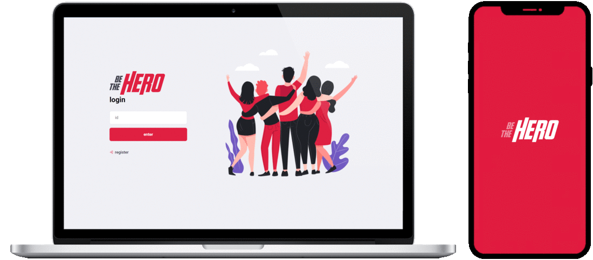

# BeTheHero

BeTheHero is a platform to help organizations with all kind of problems, by giving a financial contribution for a specific case. The management of the cases can be made in a web interface by each organization, and the search of cases can be made in a mobile interface.

This project was developed using **Node.js** to *Backend*, **React** to *Frontend Web*, and **React Native** to *Frontend Mobile*.

## Prerequirements

### Node.js

Install the latest stable version (LTS - Long Term Support) of [**Node.js**](https://nodejs.org/en/download/package-manager/).

Execute the command `node -v` to check if is already installed.

### Expo-CLI (or Android/iOS Emulator)

To test the use of the mobile interface you need an emulator of Android/iOS system, or you can use [**Expo-CLI**](https://docs.expo.io/workflow/expo-cli/).

In case of using **Expo-CLI**, you also need to install [**Expo**](https://play.google.com/store/apps/details?id=host.exp.exponent&hl=en) app in the Android mobile device or [**Expo Client**](https://apps.apple.com/us/app/expo-client/id982107779) app in the iOS mobile device.

### Configuration

* *(Required)* - Edit the file `./mobile/config.json`, to configure your local IP address: 
    * *"LOCAL_IP": "**\<LOCAL_IP\>**"*
* *(Optional)* - If you need to configure a different port for the *Backend*, edit the file `config.json` in all tree directories (`backend`, `web`, `mobile`):
    * *"PORT_BACKEND": "**\<PORT\>**"*
* *(Optional)* - If you need to configure a different port for the *Frontend Web*, edit the file `./frontend/package.json`:
    * *{ ...,  "scripts": { "start": "set PORT=**\<PORT\>** && ...", ...}, ...}*

> **NOTE:** The database system used in this project is a relational database **SQLite**. The project already has a created database, with the necessary tables but without data. So, you can just use the database in the project, or create and configure your own ([**Knex.js** documentation](http://knexjs.org/)).

## Install

The project have tree main directories: `backend`, `frontend` and `mobile`.

To install all the packages you need to run `npm install` inside each directory.

## Run

To execute the *Backend* and use the API, run `npm start`. 

To execute the *Frontend Web* and use the web interface, run `npm start`. Wait for opnening a tab in the browser with the interface.

To execute the *Frontend Mobile* and use the mobile interface, run `npm start`. Wait for opening a tab in the browser with a *QR code*, that you need to scan with your mobile device, using the **Expo** app. You also need to be connected to the same network, in both devices.

> **NOTES:**
> * The *Frontend Web* and *Frontend Mobile* depend on the *Backend* to execute operations that need access to the datatbase, and will show some errors if you try to done some of those operations without the *Backend* running.
> * When the **Expo-CLI** start running and connecting with the mobile device, if you get some error like: *Error: ENOSPC: System limit for number of file watchers reached*, try this [solution](https://github.com/guard/listen/wiki/Increasing-the-amount-of-inotify-watchers#the-technical-details).
> * If you are using *Windows* and run into problems connecting the **Explo** app in mobile device with the running **Expo-CLI**, try to turn off the *Windows Firewall* for your private network.

## Usage

### Backend

Once you run the *Backend*, you can start using and sending request, directly through the API.

| Method | URL            | Headers       | Query Params          | Route Params | Body                          |
| ------ | -------------- | ------------- | --------------------- | ------------ | ----------------------------- |
| GET    | /organizations |               |                       |              |                               |
| POST   | /organizations |               |                       |              | {name, city, email, whatsapp} |
| GET    | /cases         |               | organization_id, page |              |                               |
| POST   | /cases         | Authorization |                       |              | {title, description, value}   |
| PUT    | /cases         | Authorization |                       | case_id      | {title, description, value}   |
| DELETE | /cases         | Authorization |                       | case_id      |                               |
| POST   | /sessions      |               |                       |              | {id}                          |

### Frontend Web

With the *Backend* running, and the *Frontend Web* also up, you see the interface in your browser. Now you can register a new organization, or login with a existing one. Once you login you can manage the cases of your organization, by create, update and delete cases.

### Frontend Mobile

After scan the *QR code* in your mobile device, and again, with the *Backend* running, you will be able to see the interface of the *Frontend Mobile*. Now you can scroll down and see the list of all existing cases, from all the organizations. For each case you can see the details and see more information. Adicionaly, you can contact the organization, regarding the present case, via *email* or *WhatsApp*.

## Acknowledgments

I developed part of this project during the [OmniStack Week 11](https://github.com/Rocketseat/semana-omnistack-11) (by [Rockeseat](https://rocketseat.com.br/) and [Diego Fernandes](https://github.com/diego3g)).

## License

This project is licensed under the MIT License - see the [LICENSE.md](LICENSE.md) file for details.
